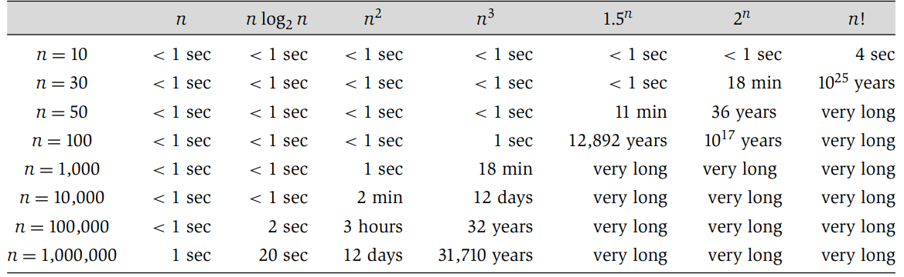

# Chapter 02 Basic of Algorithm Analysis

### 2.1 Computational Tractability

#### 2.1.3 Polynomial Time as a Definition of Efficiency

### 2.2 Asymptotic Order of Growth

#### 2.2.1 $O, \Omega, \Theta$ 

+ Upper bounds -> O
  + T(n) is O(f(n)) if there exist constants c > 0 and $n_0$ $\geq$ 0  such that for all n $\geq$ $n_0$ w e have T(n) $\leq$ c · f(n).

+ Lower bounds -> $\Omega$ 
  + T(n) is $\Omega$(f(n)) if there exist constants c > 0 and $n_0$ $\geq$ 0  such that for all n $\geq$ $n_0$ we have T(n) $\geq$ c · f(n).
+ Tight bounds -> $\Theta$ 
  + T(n) is  $\Theta$ (f(n)) if T(n) is both O(f(n)) and $\Omega$ (f(n)).

### 2.4 A Survey of Common Running Times