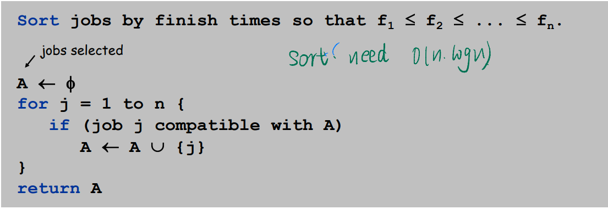
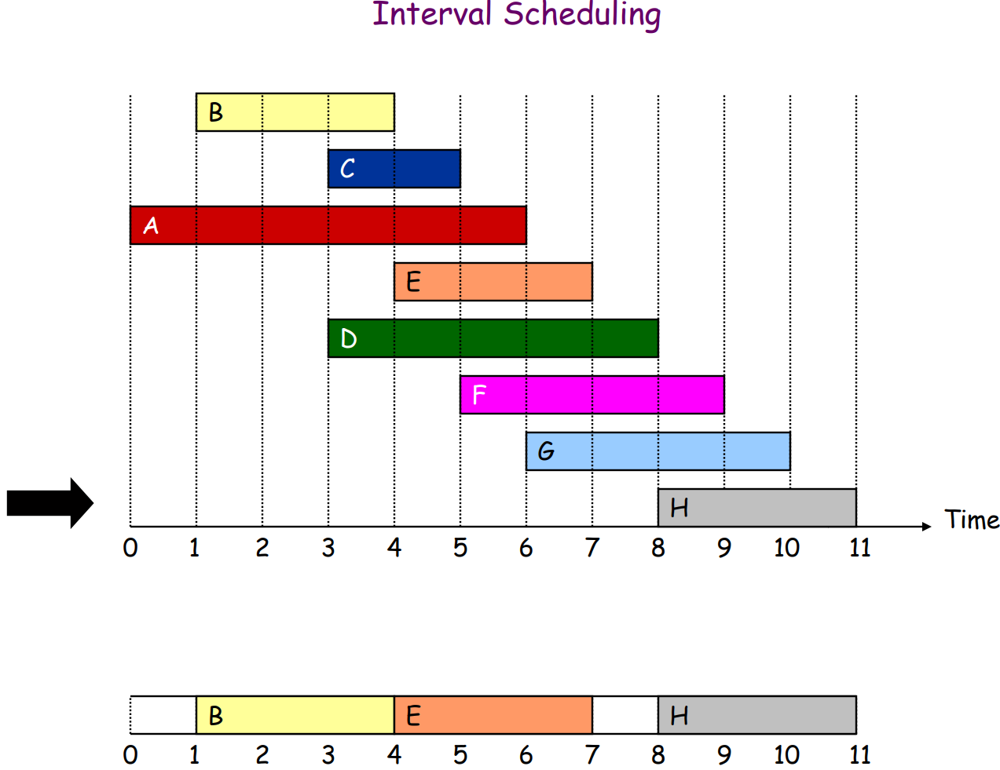
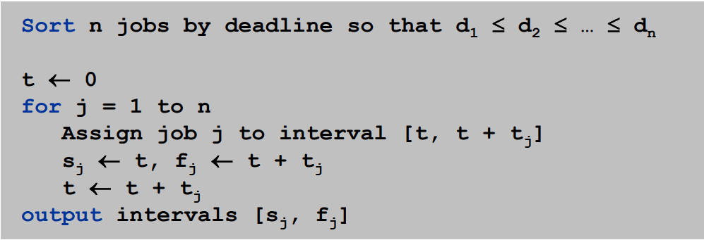

# Chapter 04 Greedy Algorithms

### 4.1 Interval Scheduling: The Greedy Algorithm Stays Ahead

##### I. Definition of problem

+ Job j starts at $s_j$ and finishes at $f_j$. 
+ Two jobs compatible if they don't overlap. 
+ Goal: find **maximum** subset of mutually compatible (no  conflict) jobs.

##### II. Greedy Algorithm

+ Consider jobs in increasing order of `finish time`.  Take each job provided it's compatible with the ones already taken.
+ Pseudocode
  + .
+ Sort (O(nlogn)) and traverse once (O(n))

.

##### III. Proof

+ The thinking of proof is important in this course
+ Pf. (contradiction)
  +  Assume greedy is not optimal, and let's see what happens
  + Let $i_1, i_2, ... i_k$ denote set of jobs selected by greedy.
  + Let $j_1, j_2, ... j_m$ denote set of jobs in the optimal solution with $i_1 = j_1, i_2 = j_2, ..., i_r = j_r$ for the largest possible value of `r`. (Which means first `r` jobs in two sequence are same)
  + Why not replacing $j_{r+1}$ with $i_{r+1}$ in the OPT? And after replacing, it still not conflict and contradict `for the largest possible value of r`.

### 4.2 Scheduling to Minimize Lateness

##### I. Definition of problem

+ Job j requires $t_j$ units of processing time and is **due** at time $d_j$.
+ If j starts at time $s_j$, it finishes at time $f_j$ = $s_j$ + $t_j$.
+ Lateness: $l_j$ = $max$ { 0, $f_j$ - $d_j$ }. 
+ Goal: schedule all jobs to minimize maximum lateness L = max  $l_j$ 
  + i.e. don't delay for too many days.

##### II. Greedy Algorithm

+ Strategy: Earliest deadline first.

+ Pseudocode
  + .