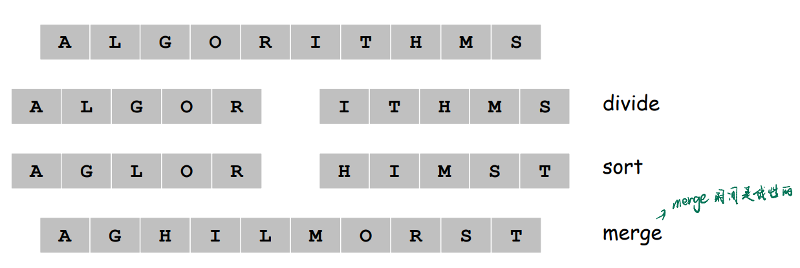
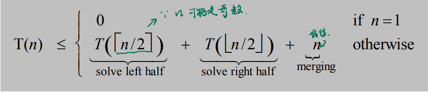
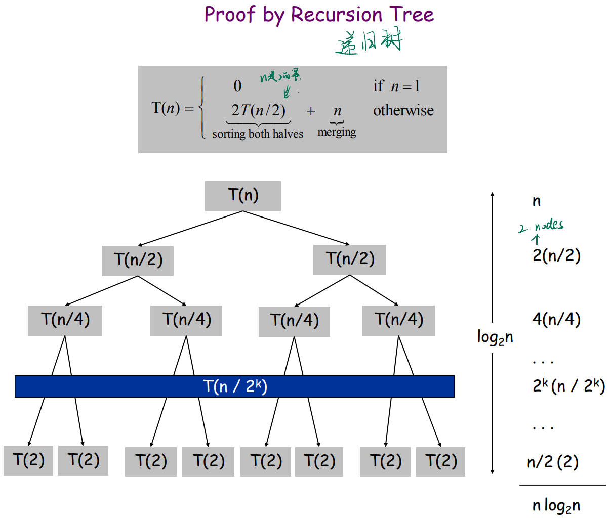
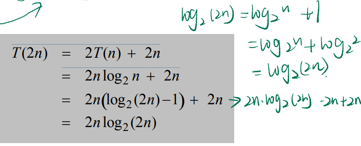
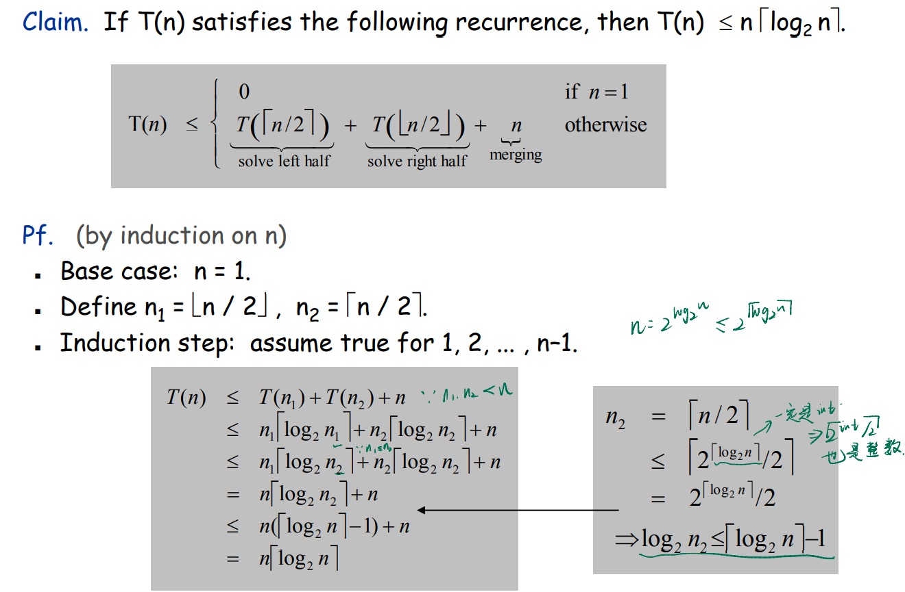

# Chapter 05 Divide and Conquer

##### Divide-and-conquer

+ Break up problem into several parts
+ Solve each part recursively
+ Combine solutions to sub-problems into overall solution

##### Most common usage

+ Break up problem of size n into two equal parts of size $\frac{1}{2}$n in linear  time
  +  $\frac{1}{2}$n is a key point to derive the time com
+ Solve two parts recursively.
+ Combine two solutions into overall solution in linear time

##### Consequence

+ Divide-and-conquer:  $\Theta$ (n log n)

### 5.1 A First Recurrence: The Mergesort Algorithm

#### I. Problem

+ Divide array into two halves. 
+ Recursively sort each half. 
+ Merge two halves to make sorted whole.

#### II. Divide and Conquer

+ The key thinking is dividing them into 2 almost equal problem

#### III. Proof

##### Proof by recursion tree

##### Proof by induction

+ Pf. (by induction on n)  like the Mathematical induction (数归)
  + Base case: n = 1. 
  + Inductive hypothesis: T(n) = n log2 n. 
  + Goal: show that T(2n) = 2n log2 (2n).
  + 
+ How is it going when n is not the power of 2?
  + 

### 5.4 Closest Pair of Points

#### I. Problem

+ Goal: Given n points in the plane, find a pair with smallest  Euclidean distance between them.
+ Assumption. No two points have same x coordinate.
  + tip: if there exist two points have same X coordinate, add a tiny distribution ($\pm(10^{-4})$), it won't effect the result.

#### II. Algorithm

