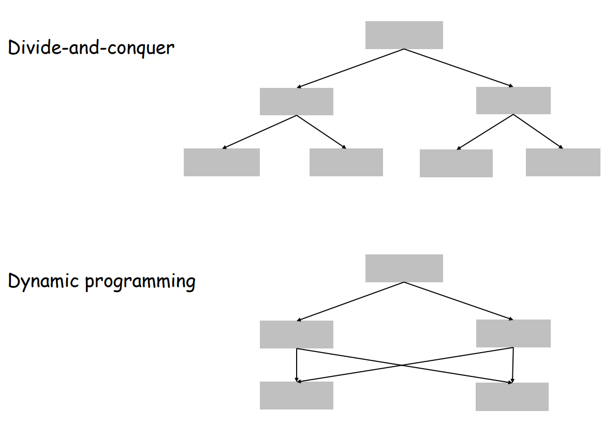
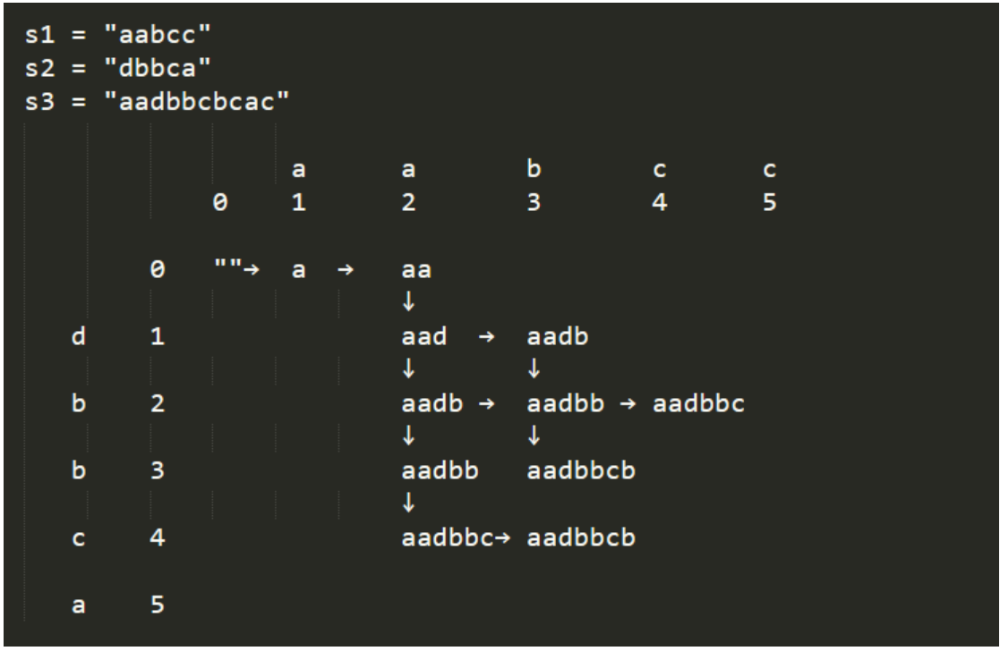
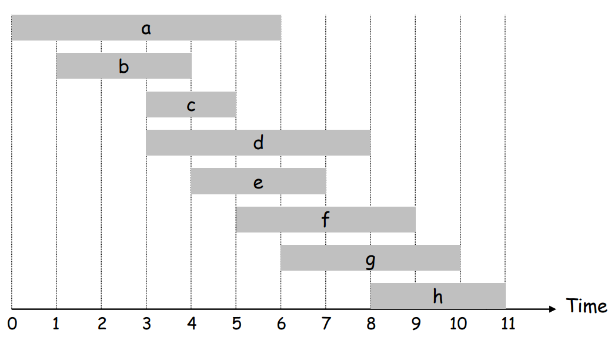
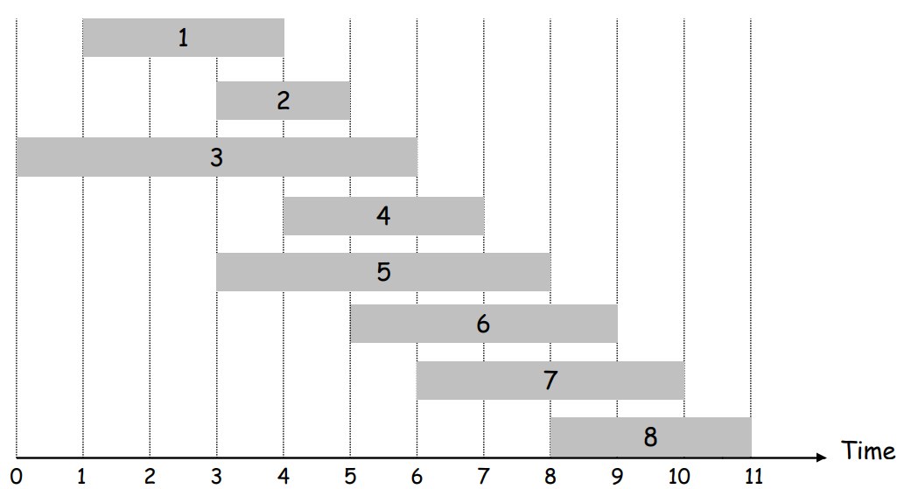
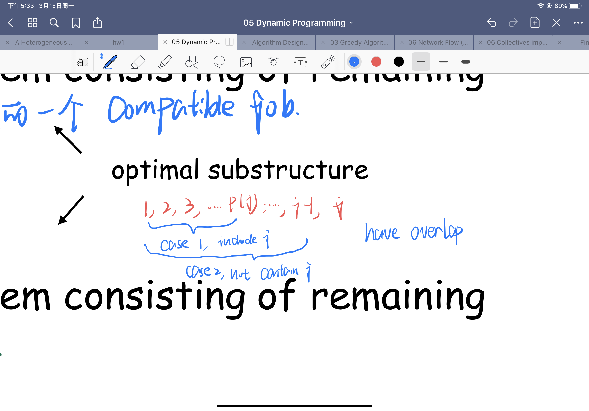
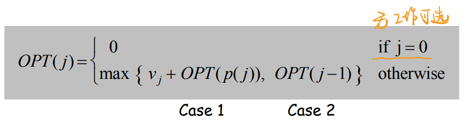
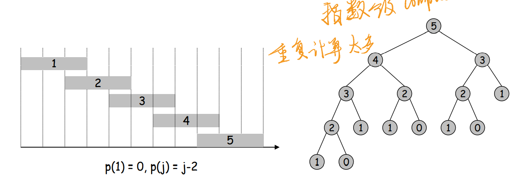
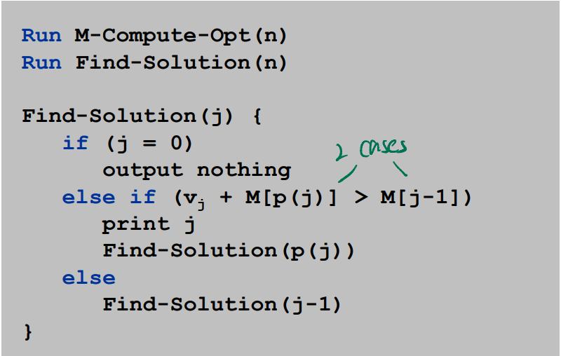

# Chapter 06 Dynamic Programming

#### Algorithmic Paradigms

+ Greed. 
  + Build up a solution incrementally, myopically optimizing some  local criterion.
  + local OPT
+ Divide-and-conquer. 
  + Break up a problem into a few sub-problems, solve each sub-problem **independently and recursively**, and combine solution  to sub-problems to form solution to original problem.
+ Dynamic programming
  + Break up a problem into a series of **overlapping**  sub-problems, and build up solutions to larger and larger sub-problems
  + notion: overlapping sub-problem, means the total sub-problems are larger than the initial problem.

#### Divide-and-conquer VS. Dynamic programming

#### ⭐⭐Significant Thinking

+ a two-dimensional **DP** table, according to the drawn path displayed below. 
+ Because it’s interleaving, so certain order still needs to be maintained, so that’s why for a valid path, it can **only go right or down**. That’s why `DP[i][j]` is depending on `DP[i - 1][j]` and `DP[i][j - 1]`.

### 6.1 Weighted Interval Scheduling

#### I. Problem

+ Job j starts at $s_j$, finishes at $f_j$, and has weight or value $v_j$.
+ Two jobs compatible if they don't overlap.
+ Goal: find `maximum` weight subset of mutually compatible jobs. (max no conflict)

+ Notion. 
  + Label jobs by finishing time: $f_1$ $\leq$$f_2$ $\leq$ . . . $\leq$ $f_n$ .
+ Def. $p(j)$ = `largest` index $i < j$ such that job $i$ is compatible with$ j$.
  + i.e no conflict and biggest index
  + ex. $p(8) = 5, p(7) = 3, p(2) = 0$.

#### II. Dynamic Programming

##### Binary Choice

OPT (j) =  value of optimal solution to the problem consisting  of job requests 1, 2, ..., j.

+ Divide into 2 cases according to if select job j itself
+ case 1 -> OPT selects job $j$
  + can't use incompatible jobs { $p(j) + 1, p(j) + 2, ..., j - 1$ }
    + because $p(j)$ is the closest compatible, $p(j)+1 ~ j-1$ are all conflict with $j$, and $j$ have already been selected.
  + must include optimal solution to problem consisting of remaining  compatible $jobs 1, 2, ..., p(j)$
+ case 2 -> OPT does not select job $j$
  + must include optimal solution to problem consisting of remaining  compatible jobs $1, 2, ..., j-1$
+ 2 cases divide the problem into 2 sub-problem, but they overlapped.

+ So we get the formula

##### Brute Force

+ We have defined the problem, now we start to find the algorithm to solve it.
+ Recursive algorithm fails spectacularly because of  redundant sub-problems -> exponential algorithms.
  + too much redundancy

##### Memorization

+ Store results of each sub-problem in a cache; lookup as  needed.
+ optimization
  + On the basis of brute force, only calculate $OPT(i)$ once and save the result.
+ Memorized version of algorithm takes $O(n log n)$ time
  + Sort by finish time:$ O(n log n)$.
  + Computing $p(·)$ : $O(n)$ after sorting by start time
  + $O(n)$ if jobs are pre-sorted by start and finish times

##### Finding a Solution

+ After finding OPT(n), do some post-processing
+ \# of recursive calls $\leq$ -> $O(n)$.

+ Top-down vs. bottom-up
  + Top-down: May skip unnecessary sub-problems
    + shortcoming -> recursion sometimes is expensive
  + Bottom-up: Save the overhead in recursion

### 6.4 Knapsack Problem

#### I. Problem

+ Given n objects and a "knapsack."
+  Item $i$ weighs $w_i > 0$ kilograms and has value $v_i > 0$.
+ Knapsack has capacity of W kilograms.
+ Goal: fill knapsack so as to maximize `total value`.

#### II. Dynamic Programming

**Adding a New Variable** is a key point and idea.

+ Def. $OPT(i, w)$ = max profit subset of items $1, …, i$ with weight limit $w$.
+ 2 parameters, $w$ is the remaining weight.