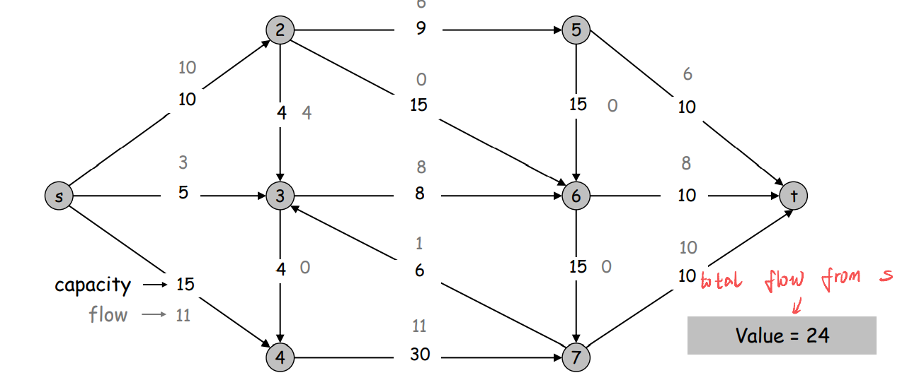
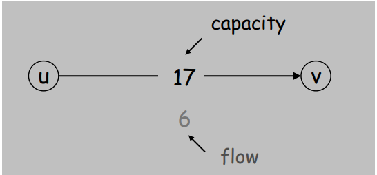
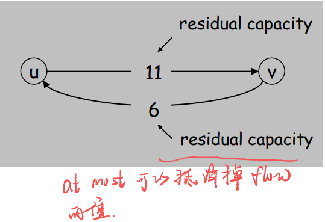
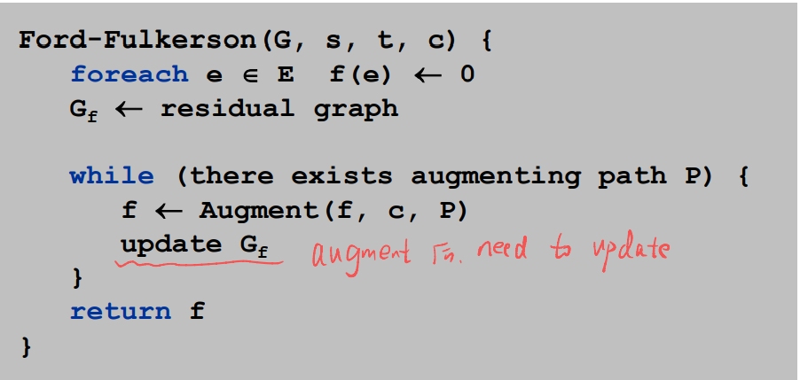
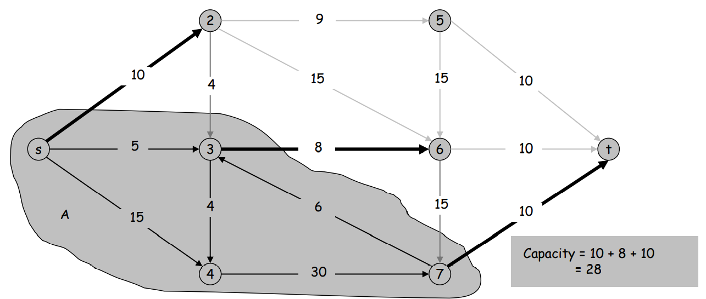

# Chapter 07 Network Flow

### 7.1 Max-flow and Ford-Fulkerson Algorithm

#### I. Problem

+ G = (V, E) = directed graph

+ Two distinguished nodes: s = source, t = sink.
+ c(e) = nonnegative capacity of edge e

##### A. Def.

+ The value of a flow f is: $v( f ) = \sum{f (e)}$

##### B. Maximum Flow Problem

+ Max flow problem. Find s-t flow of maximum value
+ Same as above, greedy doesn't work

#### II. Concept

##### A. Residual Graph

+ Important concept, throughout the network flow work
+ Original edge: $e = (u, v) \in E$
  + Flow f(e), capacity c(e)

+ Residual edge.
  +  "Undo" flow sent.
  + $e = (u, v)$ and $e^R = (v, u).$

##### B. Augmenting Path

+ Def. Augmenting path
  + a simple s-t path P in the residual graph $G_f$ 
+ Def. Bottleneck capacity
  + of an augmenting path P is the minimum residual  capacity of any edge in P
+ Def. Claim
  + After augmentation, f is still a flow

#### III. Ford-Fulkerson Algorithm

- Start with f(e) = 0 for all edge e $\in$ E.
  - flow = 0 at start
- Find an augmenting path P in the residual graph  $G_f$ 
- Augment flow along path P.
- Repeat until you get stuck.

### 7.2 Max-flow and Min-cut

#### I. Problem

Minimum Cut Problem

##### A. Concept

+ An s-t cut is a partition (A, B) of V with s $\in$ A and t $\in$ B.
+ The capacity of a cut (A, B) is: $cap(A,B) = \sum\limits_{e-out-of-A} c(e)$
+ Min s-t cut problem.  
  + Find an s-t cut of minimum capacity

+ Flow value lemma
  + Let f be any flow, and let (A, B) be any s-t cut. Then
  + $\sum\limits_{e-out-of-A} f(e) - \sum\limits_{e-in-of-A} f(e) = v(f)$

+ cap(A, B)
  + sum of A to B edge capacity

#### II. Max-Flow Min-Cut Theorem

+ We know in 7.1, augmenting path is to find the **max flow**
+ In this case, we want to prove the **max flow = min cut**

##### A. Lemma

+ Augmenting path theorem
  + Flow f is a max flow iff (if and only if) there are no  augmenting paths. 
+ Max-flow min-cut theorem. [Ford-Fulkerson 1956] 
  + The value of the  max flow is equal to the value of the min cut.

##### B. Proof

+ Proof strategy. We prove both simultaneously by showing the  equivalence of the following three conditions for any flow f:
  + (i) There exists a cut (A, B) such that v(f) = cap(A, B).
  + (ii) Flow f is a max flow.
  + (iii) There is no augmenting path relative to f.
+ (i) $\Rightarrow$ (ii) 
  + This was the corollary to weak duality lemma.
+ (ii) $\Rightarrow$ (iii) We show contrapositive.
  + If there exists an augmenting path, then we can improve f by  sending flow along path.

### 7.3 Choosing Good Augmenting Paths