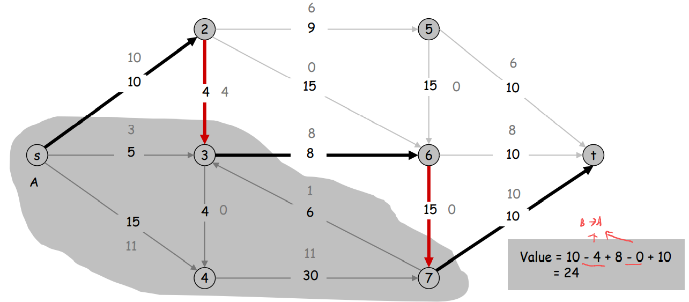

# Chapter 07 Network Flow

### 7.1 Max-flow and Ford-Fulkerson Algorithm

#### I. Problem

+ G = (V, E) = directed graph

+ Two distinguished nodes: s = source, t = sink.
+ c(e) = nonnegative capacity of edge e

##### A. Def.

+ The value of a flow f is: $v( f ) = \sum{f (e)}$

##### B. Maximum Flow Problem

+ Max flow problem. Find s-t flow of maximum value
+ Same as above, greedy doesn't work

#### II. Concept

##### A. Residual Graph

+ Important concept, throughout the network flow work
+ Original edge: $e = (u, v) \in E$
  + Flow f(e), capacity c(e)

+ Residual edge.
  +  "Undo" flow sent.
  + $e = (u, v)$ and $e^R = (v, u).$

##### B. Augmenting Path

+ Def. Augmenting path
  + a simple s-t path P in the residual graph $G_f$ 
  + ❗Notion: in residual graph
+ Def. Bottleneck capacity
  + of an augmenting path P is the minimum residual  capacity of any edge in P
+ Def. Claim
  + After augmentation, f is still a flow

#### III. Ford-Fulkerson Algorithm

- Start with f(e) = 0 for all edge e $\in$ E.
  - flow = 0 at start
- Find an augmenting path P in the residual graph  $G_f$ 
- Augment flow along path P.
- Repeat until you get stuck.

### 7.2 Max-flow and Min-cut

#### I. Problem

Minimum Cut Problem

##### A. Concept

+ An s-t cut is a partition (A, B) of V with s $\in$ A and t $\in$ B.
+ ⭐The capacity of a cut (A, B) is: $cap(A,B) = \sum\limits_{e-out-of-A} c(e)$
  + Definition of $cap(A,B)$ is important
+ Min s-t cut problem.  
  + Find an s-t cut of minimum capacity

+ ❗Notion:
  + Capacity is only out of A, not reduce the capacity of edge into A.
  + Value need to reduce the capacity of edge into A

+ Flow value lemma
  + Let f be any flow, and let (A, B) be any s-t cut. Then
  + $\sum\limits_{e-out-of-A} f(e) - \sum\limits_{e-in-of-A} f(e) = v(f)$

+ cap(A, B)
  + sum of A to B edge capacity

#### II. Max-Flow Min-Cut Theorem

+ We know in 7.1, augmenting path is to find the **max flow**
+ In this case, we want to prove the **max flow = min cut**

##### A. Lemma

+ Augmenting path theorem
  + Flow f is a max flow iff (if and only if) there are no  augmenting paths. 
+ Max-flow min-cut theorem. [Ford-Fulkerson 1956] 
  + The value of the  max flow is equal to the value of the min cut.

##### B. Proof

+ Proof strategy. We prove both simultaneously by showing the  equivalence of the following three conditions for any flow f:
  + (i) There exists a cut (A, B) such that v(f) = cap(A, B).
  + (ii) Flow f is a max flow.
  + (iii) There is no augmenting path relative to f.
+ (i) $\Rightarrow$ (ii) 
  + This was the corollary to weak duality lemma.
+ (ii) $\Rightarrow$ (iii) We show contrapositive.
  + If there exists an augmenting path, then we can improve f by  sending flow along path.

### 7.3 Choosing Good Augmenting Paths

#### I. Choosing Good Augmenting Paths

+ Selection
  + Some choices lead to exponential algorithms.   -> $O(2^n)$
  + Clever choices lead to polynomial algorithms.   -> $O(n)$
+ Goal
  + Can find augmenting paths efficiently.
  + Few iterations.
+ Choose augmenting paths with: [Edmonds-Karp 1972, Dinitz 1970]
  + Max bottleneck capacity.
  + Fewest number of edges.
  + Sufficiently large bottleneck capacity.
  + PS: Find the large enough bottleneck capacity

#### II. Capacity Scaling

+ Intuition -> Choosing path with high bottleneck capacity
  + Maintain scaling parameter $\Delta$
  + Let the $\Delta$-residual graph $G_f(\Delta)$ be the subgraph of the residual  graph consisting of only arcs with capacity at least $\Delta$.

+ Correctness -> If the algorithm terminates, then f is a max flow.
  + Pf.
  + By integrality invariant, when $\Delta$ = 1 $\Rightarrow$ $G_f(\Delta)$ = $G_f$.
    + $\Delta$ = 1, it won't filter out any edges
  + Upon termination of $\Delta$ = 1 phase, there are no augmenting paths.

### 7.5 Bipartite Matching

#### I. Definition

+ Matching
  + Input: undirected graph G = (V, E).
  + M $\subseteq$ E is a matching if each node appears in at most one edge in M.
    + i.e. one node, one edge
  +  Max matching: find a max cardinality matching.

+ Bipartite matching
  + Input: undirected, bipartite graph G = (L $\cup$ R, E).
    + like hw2 problem 5 and 6, constructs a bipartite graph
  + M $\subseteq$ E is a matching if each node appears in at most one edge in M.
  +  Max matching: find a max cardinality matching.

#### II. Algorithm

+ Max flow formulation
  + Create digraph G' = (L $\cup$ R $\cup$ {s, t}, E' ).
  + Direct all edges from L to R, and assign infinite (or unit) capacity.
  + Add source s, and unit capacity edges from s to each node in L.
  + Add sink t, and unit capacity edges from each node in R to t.

##### A. Proof

+ Theorem. 
  + Max cardinality matching in G = value of max flow in G'.
+ Pf. first prove  $\leq$
  + Given max matching M of cardinality k.
  + Consider flow f that sends 1 unit along each of k paths.
  + f is a flow, and has cardinality k.
  + My understanding
    + 左边有k条边match，右边至少可以找到这么k path，所以flow value至少是k ->  左边 $\leq$ 右边

+ Pf. prove  $\geq$
  + Let f be a max flow in G' of value k.
  + Integrality theorem $\Rightarrow$ k is integral and can assume f is 0-1
  + Consider M = set of edges from L to R with f(e) = 1
    + each node in L and R participates in at most one edge in M
    + |M| = k: consider cut (L $\cup$ s, R $\cup$ t)
  + My understanding
    + 中间的 flow 非0即1 -> max matching $\geq$ k -> 左边  $\geq$  右边
+ Therefore, Max cardinality matching in G = value of max flow in G'

### 7.7 Extensions to Max Flow

#### I. Circulation with demands

+ Directed graph G = (V, E)
+ Edge capacities c(e), e $\in$ E
+ Node supply and demands d(v), v $\in$ V
  + demand if d(v) > 0; supply if d(v) < 0; transshipment if d(v) = 0

##### A. Definition of Circulation

+ ⭐⭐Circulation is the way of flow distribute, and it satisfies the condition
  + And we know it has many way of flow, integer theorem means -> we could find a way that all flow distribute are integer -> iff add capacities and demands are integers

+ A circulation is a function that satisfies
  + For each e $\in$ E: 0 $\leq$ f(e) $\leq$ c(e) (capacity)
  + For each v $\in$ V: $\sum\limits_{e-in-to-v}{f(e)} - \sum\limits_{e-out-to-v}{f(e)}=d(v)$ (conservation)
+ First, we need clarify the definition of problem. What's the circulation problem?
  + given (V, E, c, d), does there exist a circulation?

##### B. Max flow formulation

translate it to max flow

+ Step
  + Add new source s and sink t
  + For each v with d(v) < 0, add edge (s, v) with capacity -d(v)
  + For each v with d(v) > 0, add edge (v, t) with capacity d(v)
  + Claim: G has circulation iff G' has max flow of value D

+ Integrality theorem
  + If all capacities and demands are integers, and  there exists a circulation, then there exists one that is integer-valued.
  + ❓What's the meaning of this theorem?
    + Ans: And we know it has many way of flow, integer theorem means -> we could find a way that all flow distribute are integer -> iff add capacities and demands are integers

#### II. Circulation with Demands and Lower Bounds

Add lower bounds based on above condition(up bounds is capacity)

+ A circulation is a function that satisfies
  + For each e $\in$ E: $\ell(e) \leq f(e) \leq c(e) $  (capacity)
    + 0 -> $\ell(e)$
  + For each v $\in$ V: $\sum\limits_{e-in-to-v}{f(e)} - \sum\limits_{e-out-to-v}{f(e)}=d(v)$ (conservation)
+ Translation

### 7.8 Survey Design

#### I. Problem Definition

A classical circulation problem

+ Def
  + Design survey asking $n_1$ consumers about $n_2$ products.
  + Can only survey consumer i about a product j if they own it.
  + Ask consumer i between $c_i$ and $c_i'$  questions.
  + Ask between $p_j$ and $p_j'$ consumers about product j
+ Goal
  + Design a survey that meets these specs, if possible

#### II. Algorithm

+ Formulate as a circulation problem with lower bounds
  + Include an edge (i, j) if customer own product i.
  + Integer circulation $\Leftrightarrow$ feasible survey design.

### 7.10 Image Segmentation

#### I. Problem Definition

+ Def
  + Central problem in image processing
  + Divide image into coherent regions
+ Foreground / background segmentation  ->  To decide which part is foreground, which is background
  + Label each pixel in picture as belonging to foreground or background.
  + V = set of pixels, E = pairs of neighboring pixels
  + $a_i$ t 0 is likelihood pixel i in foreground
    + possibility of pixel in fore
  + $b_i$ t 0 is likelihood pixel i in background
  + $p_{ij}$ t 0 is separation penalty for labeling one of i and j as foreground, and the other as background
+ Goal
  + Accuracy: if $a_i$ > $b_i$s in isolation, prefer to label i in foreground
  + Smoothness: if many neighbors of i are labeled foreground, we  should be inclined to label i as foreground
  + ⭐Find partition (A, B) that maximizes
    + A -> foreground; B -> background

#### II. Basic Concept

+ A and B
  + A is the set of pixels with high probability in the foreground
  + A is the set of pixels with high probability in the background
+ $a_i$ and $b_i$
  + $a_i$ t 0 is likelihood pixel i in foreground
  + $b_i$ t 0 is likelihood pixel i in background
  + ⭐Each pixel has $a_i$ and $b_i$

#### III. Method

+ Formulate as min cut problem
  + Maximization
  + No source or sink
  + Undirected graph
+ Turn into minimization problem -> just the translation of max and min

+ Formulate as min cut problem -> min cut problem is the part I can't fully understand ->much better after google it {2021-03-29 16:10:46​}
  + G' = (V', E')
  + Add source to correspond to foreground; add sink to correspond to background
  + Use two anti-parallel edges instead of undirected edge
+ Consider min cut (A, B) in G'
  + A = foreground

+ We can see cut(A,B) is the capacity of edge A -> B
  + $a_j,b_i,p_{ij}$ are all A->B
  + sum of them
  + minximum

### 7.11 Project Selection

#### I. Project Selection

+ Projects with prerequisites
  + Set P of possible projects. Project v has associated revenue $p_v$ (can be negative value)
    + $p_v<0$ -> loss
    + some projects generate money: create e-commerce interface, design web  page
    + others cost money: upgrade computers, get site license
  + Set of prerequisites E. If (v, w) $\in$ E, can't do project v unless also  do project w
    + want to do v, do w first
  + A subset of projects A $\subseteq$ P is `feasible` if the prerequisite of every  project in A also belongs to A

+ Project selection
  + Choose a feasible subset of projects to maximize  revenue
+ Prerequisite graph
  + Include an edge from v to w if can't do v without also doing w
  + {v, w, x} is feasible subset of projects
  + {v, x} is infeasible subset of projects
  + easy to understand according to graph

+ Min cut formulation
  + Assign capacity f to all prerequisite edges
  + Add edge (s, v) with capacity $p_v$ if $p_v$ > 0
  + Add edge (v, t) with capacity $-p_v$ if $p_v$ < 0
  + For notational convenience, define $p_s$ = $p_t$ = 0

+ Claim. (A, B) is min cut iff A  { s } is optimal set of projects
  + Infinite capacity edges ensure A  { s } is feasible

### 7.12 Baseball Elimination

#### I. Baseball Elimination

+ Baseball elimination problem, know about $w_x$ and $g_{xy}$
  + Set of teams S
  + Distinguished team z $\in$ S
  + Team x has won $w_x$ games already
  + Teams x and y play each other $g_{xy}$ additional times
  + Is there any outcome of the remaining games in which team z  finishes with the most (or tied for the most) wins?
+ Can team 3 finish with most wins?
  + Assume team 3 wins all remaining games $\Rightarrow$ w3 + g3 wins
  + Divvy(arrange) remaining games so that all teams have $\leq$ w3 + g3 wins

+ Graph
  + nodes connect with s is the game i needs to play with j(i,j is 1-5 except 3, and 1-4 = 4-1), so they have $C^2_4 = 6$ conditions 
  + edge `1-4` points to `1` represents the times 1 wins.
  + if the edge leaving source is not full, it means one of `1,2,4,5` has already full, team 3 has no possible to win.
+ Theorem 
  + Team 3 is not eliminated iff max flow saturates all edges  leaving source
    + i.e. all edges leaving source $s$ f(e) = c(e)

#### II. Baseball Elimination: Explanation for Sports Writers

A specific case

Detroit is already out, if Detroit wins all 27 times, 76 wins. But NY has 75 wins, if NY all lose in the next 28 games, we could see Boston will play with NY 8 times. 69 + 8 =77 wins.

+ Certificate of elimination. R = {NY, Bal, Bos, Tor}      ->      it uses average wins to prove Detroit is out
  + Have already won w(R) = 278 games
  + Remaining games among R is r(R) = 3+8+7+2+7 = 27
  + Average team in R wins at least (278+27)/4 > 76 games

##### A. Theorem. [Hoffman-Rivlin 1967] 

+ Team z is eliminated iff there exists  a subset T* such that

##### B. Proof

+ Left is
  + Team z is eliminated
+ Right is 
  + there exists  a subset T* such that

+ $\Leftarrow$ right to left
  + The average number of wins of teams in T* is larger than the  maximum number of wins of z
    + If the `left games g_z + wins w_z` < `average` -> z is out
+ $\Rightarrow$ left to right ⭐⭐ max flow
  + Use max flow formulation, and consider min cut (A, B)
  + Define T* = team nodes on source side of min cut
    + source side, generally is set A
  + Observe x-y $\in$ A iff both x $\in$ T* and y $\in$ T*
    + infinite capacity edges ensure if x-y $\in$ A then x $\in$ A and y $\in$ A
      + It would never cut the `inf` edge for min cut
    + if x $\in$ A and y $\in$ A but x-y $\in$ B, then adding x-y to A decreases  capacity of cut
  + Since z is eliminated, by max-flow min-cut theorem
    + g(S-{z}) is the left games between teams except team z
    + z is out -> max flow can not full all edges start from s

### Personal

How to get min-cut?

+ Step
  + 1.Find a path s -> t by max flow algorithm
  + 2.if there is a edge reverse in residual graph (f(e) = c(e)), add it to cut edge set
  + 3.Repeat 1 and 2
+ When no path s -> t, it means we get max flow value, and we get the min cut set.

