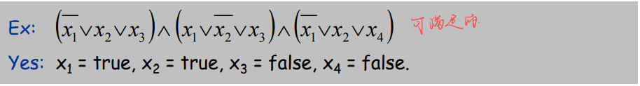
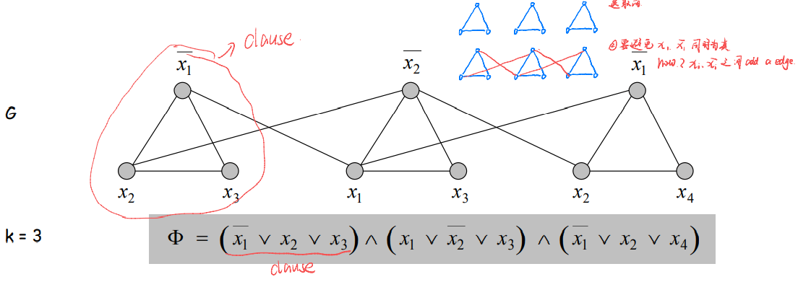

# Chapter 08 NP and Computational Intractability

### How to prove a problem is in NP?

Give certificate and certifier to prove that.

⭐⭐理解：也就是给一个输入，设计一个$算法_1$去验证这个输入是否是答案，而$算法_1$是 polynomial time.

#### example by 3-SAT

##### I. Problem Definition

+ SAT. Given a CNF formula $\Phi$, is there a satisfying assignment?  是否存在可满足的分配

##### II. Certificate

+ An assignment of truth values to the n boolean variables.
  + 将真值分配给n个布尔变量
  + 是否意为给所有变量赋值为1？

##### III. Certifier

+ Check that each clause in $\Phi$ has at least one true literal.
  + Traverse the clause can finish the check, so the certification is in polynomial time.
  + i.e. the algorithm or method to check

##### IV. Ex

##### V. Conclusion

+ SAT is in NP

### How to prove a problem is NP complete

+ NP-complete. 
  + A problem Y in NP with the property that for every  problem X in NP, X $\leq_P$ Y.

#### Step

Recommended steps provided by homework in CS240

+ Recipe to establish NP-completeness of problem Y
  + Step 1. Show that Y is in NP.
    + Reference how to prove a problem is in NP
  + Step 2. Choose an NP-complete problem X
    + Such as classic 3-SAT
  +  Step 3. Prove that X $\leq_P$ Y.
    + Prove 3-SAT $\leq_P$ Y

### Understand Reduction

X $\leq_P$ Y

+ Find the subset of Y, prove this subset is equivalent to Y.
+ 找到一个Y的子集的 case，证明这个 case 等价于X，也就是 iff

### 8.1 Polynomial-Time Reductions

#### I. Classify Problems

##### A. Definition

+ Q. Which problems will we be able to solve in practice?
+ A. A working definition. [Cobham 1964, Edmonds 1965, Rabin 1966]  
  + Those with polynomial-time algorithms. 
  + (In practice, poly-time  algorithms scale to huge problems.)
  + i.e. If the problem exists polynomial-time algorithm 
+ Desiderata
  + Classify problems  ->  what we want to do
  + according to those that can be solved in polynomial-time and those that cannot
+ Provably requires exponential-time
  + Given a program of size log k, does it halt in at most k steps?
  + Given a board position in an n-by-n generalization of checker, can  black guarantee a win?

#### II. Polynomial-Time Reduction

⭐Important to understand it

+ Desiderata
  + Suppose we could solve Y in polynomial-time. What else  could we solve in polynomial time?
+ **Reduction**
  + Problem X polynomial-time reduces to problem Y if  arbitrary instances of problem X can be solved using
    + Polynomial number of standard computational steps, plus
    + Polynomial number of calls to `oracle` that solves problem Y
    + oracle -> A black box that solves instances of Y in a single step
+ Notation
  + X $\leq_P$ Y
  + can solve Y -> can solve X
+ Remarks
  + We pay for time to write down instances sent to black box $\Rightarrow$ instances of Y must be of polynomial size.
+ Design algorithms
  + If X $\leq_P$ Y and Y can be solved in polynomial-time,  then X can also be solved in polynomial time
+ Establish intractability
  + If X $\leq_P$ Y and X cannot be solved in  polynomial-time, then Y cannot be solved in polynomial time.
+ Establish equivalence
  + If X $\leq_P$ Y and Y $\leq_P$ X, we use notation X $\equiv_P$ Y. In this case, X can be solved in polynomial time iff Y can be.
  + 所以在做题时其实证明的是 iff 而不仅是单边归约

#### III. Reduction By Simple Equivalence

##### A. Independent Set

### 8.2 Reductions via "Gadgets"

#### I. Satisfiability

⭐Remember these concepts, they are basic of follow part

+ Literal	->	文字
  + A Boolean variable or its negation
  + $x_i$ or $\bar{x_i}$
+ Clause   ->    子句
  + A disjunction of literals
  + $C_j=x_1\or\bar{x_2}\or x_3$
+ Conjunctive normal form    ->    CNF    ->    合取范式
  + A propositional formula $\Phi$ that is the conjunction of clauses
  + $\Phi=C_1\and C_2\and C_3\and C_4$
+ SAT
  + Given CNF formula $\Phi$, does it have a satisfying truth assignment?
  + $\Phi$ is true    ->    all $C_i$ is true    ->    one of Literals in Clause is true
+ 3-SAT
  + SAT where each clause contains exactly 3 literals

#### II. 3 Satisfiability Reduces to Independent Set

⭐⭐This is a typical reducing case, and the format of homework could follow this

##### A. Construct

+ Claim
  + 3-SAT $\leq_p$  `INDEPENDENT-SET`
+ Pf
  + Given an instance $\Phi$ of 3-SAT, we construct an instance (G, k) of  `INDEPENDENT-SET` that has an independent set of size k iff $\Phi$ is satisfiable
+ Construction    ->    
  + G contains 3 vertices for each clause, one for each literal
  + Connect 3 literals in a clause in a triangle
  + Connect literal to each of its own negations

##### B. Proof

+ Claim
  + G contains independent set of size k = |$\Phi$| iff $\Phi$ is satisfiable.
+ Pf    $\Rightarrow$    Let S be independent set of size k    ->    k is the num of triangle
  + S must contain exactly one vertex in each triangle
    + i.e. each triangle, at least one vertex in S
  + Set these literals to true
    + we know $x_2$ connect with $\bar{x_2}$, so the variable value have no possibility to conflict
  + Truth assignment is consistent and all clauses are satisfied
+ Pf    $\Leftarrow$    Given satisfying assignment, select one true literal from each  triangle. This is an independent set of size k
  + Observe the graph, it is exactly right

#### III. Review

##### A. Feature

Why review? Because it is a basic and important method

+ Basic reduction strategies
  + Simple equivalence: INDEPENDENT-SET $\equiv_P$ VERTEX-COVER
    + Reduce to each other
  + Special case to general case: VERTEX-COVER $\leq_P$ SET-COVER
  + Encoding with gadgets: 3-SAT $\leq_P$ INDEPENDENT-SET
+ Transitivity
  + If X $\leq_P$ Y and Y $\leq_P$ Z, then X $\leq_P$ Z
+ Pf idea
  + Compose the two algorithms
+ Ex: 
  + 3-SAT $\leq_P$ INDEPENDENT-SET $\leq_P$ VERTEX-COVER $\leq_P$ SET-COVER

##### B. Self-Reducibility

+ Decision problem
  + Does there exist a vertex cover of size $\leq$ k?
+ Optimization problem
  + Find vertex cover of minimum cardinality

Chapter 8 cares about decision

+ Self-reducibility    ->    Optimization problem $\leq_P$ decision version
  + Applies to all (NP-complete) problems in this chapter
  + Justifies our focus on decision problems
+ Ex: to find min cardinality vertex cover
  + (Binary) search for cardinality k* of min vertex cover
  + Find a vertex v such that `G - {v}` has a vertex cover of size d k* - 1    ->    a natural idea
    + v must be in a vertex cover of size $\leq$ k*
    + Prove by construction: a vertex cover of `G - {v}` plus v must be a  vertex cover of G
  + Include v in the vertex cover
  + Recursively find a min vertex cover in `G - {v}`

### 8.3 Definition of NP

#### I. Decision Problems

+ Decision problem  ->  the answer of decision problem is yes or no
  + X is a set of strings
  + Instance: string $s$
  + Algorithm A solves problem X: $A(s)$ = yes iff s $\in$ X
+ Polynomial time
  + Algorithm A runs in polynomial time if for every string $s$, $A(s)$ terminates in at most $p(|s|)$ "steps", where p($\cdot$) is some  polynomial. 
  + $p(|s|)$ is length of $s$

#### II. Definition of P, NP and EXP

##### A. P

+ P. Decision problems for which there is a poly-time algorithm.

##### B. NP

+ Certification algorithm intuition
  + Certifier views things from "managerial" viewpoint
  + Certifier doesn't determine whether $s$ $\in$ X on its own; rather, it checks a proposed proof $t$ that $s \in X$.
  + 给出一个证据 $t$ 证明 $s \in X$，也就是说验证这个 $s$ 是否为 yes-instance